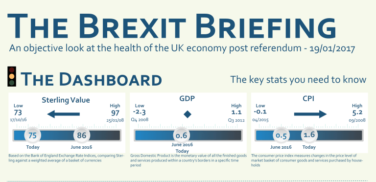
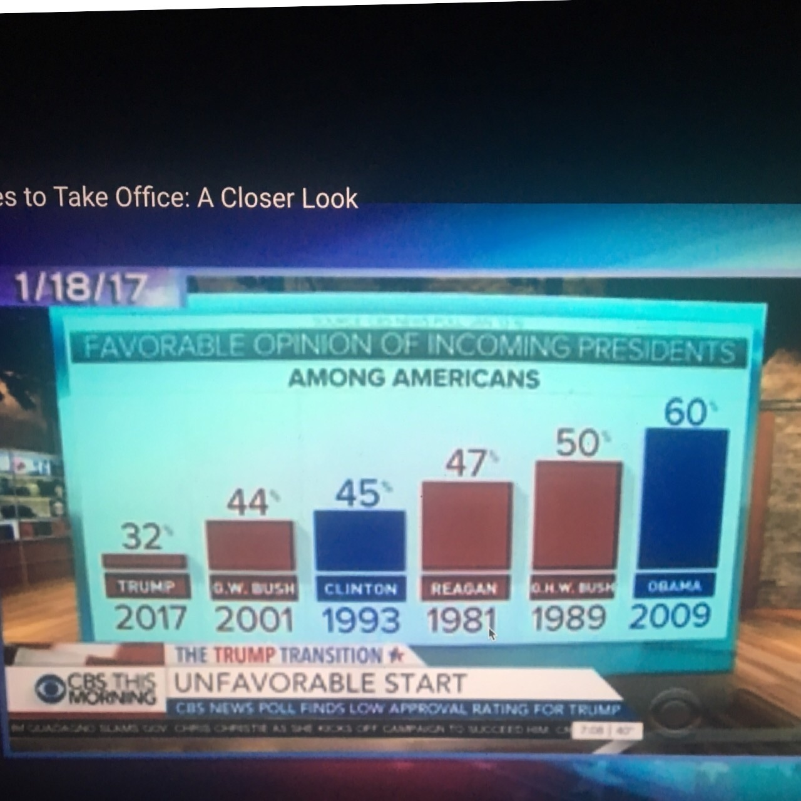
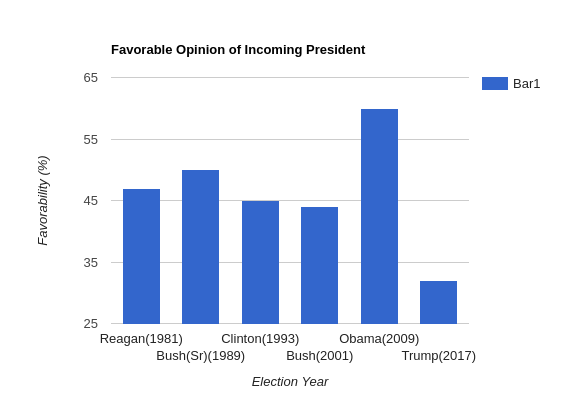

# Design Critique
David Ayeke
Jan. 23, 2017

## Critique of a likable visualization.

<figure>

  <figcaption>Fig1. "The Brexit Breifing" James Hemson. Jan. 01 2017
</figure>

### Summary

This visualization was created by James Hemson out of frustration for the British media's lack of objectivity in describing the UK's economic status after the June referendum. This visualization compares the current value of key economic statistics with their value before the referendum as well as their high and low value over the last decade.

#### The text tells a story

This visualization is simple to digest. Each of the three graphs provide context to their respective number lines through the left and right labels. In the case of the "Sterling Value" graph, the reader understands that not only is the sterling value lower than it was before the referendum, the lowest sterling value in the last decade happened after the referendum and no immediate recovery seems to be happening.

#### The whole picture

The placement of each of the graphs aids Hemson's attempt to create an objective look at the UK after the referendum. Hemson was originally frustrated that media sources would partition economic data to either support the referendum decision by showing the growth in CPI or critique it by showing the decline of the sterling value. Hemson show the most important economic statistics: sterling value, gdp, and cpi together. This allows the user to make there own decision.

#### Low data ink ratio

While Tufte believes that visualizations should maximize the amount of ink dedicated to representing data, I think that a good amount of ink should be spent on visual embellishments that provide context. Each of this visualization's number lines use a gradient to distinguish between high and low values, and has an arrow describing the direction the values change over time. These embellishments are unecessary, but help me understand the visualization's objectives much easier.

## Critique of a detestable visualization  

<figure>

  <figcaption>Fig1. "The Brexit Breifing" James Hemson. Jan. 01 2017
</figure>

### Summary

This visualization was shown on CBS's "This Morning News". It is suppose to show the favorability of the last few incoming presidents; however, the data does not match the visualization. Trump's 32% favorability bar is significantly less than half of Obama's 60% favorability bar. I dislike how the visualization skews this result.
The results are also ordered by favorability, rather by year. This makes it difficult to tell how opinions have changed amongst Americans over the years.

## Fixed visualization

<figure>

  <figcaption>Fig1. "The Brexit Breifing" James Hemson. Jan. 01 2017
</figure>

This visualization now gives an accurate representation of the favorability ratings of the last few presidents. It also removes the color pallet of the previous visualization, so that results can't be skewed by the readers political affiliation. Finally it is organized by year to show the results over time.
